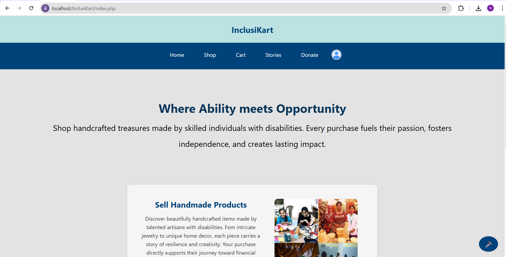
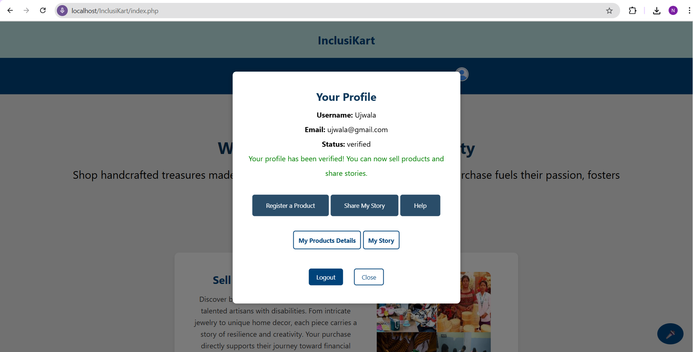
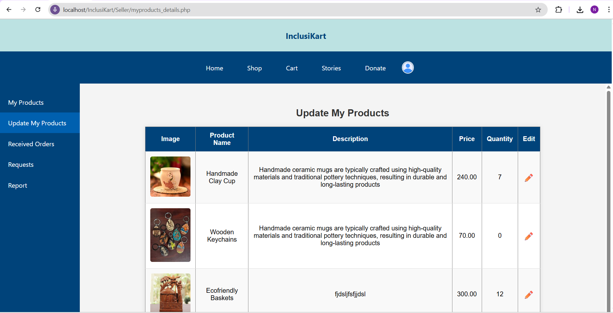
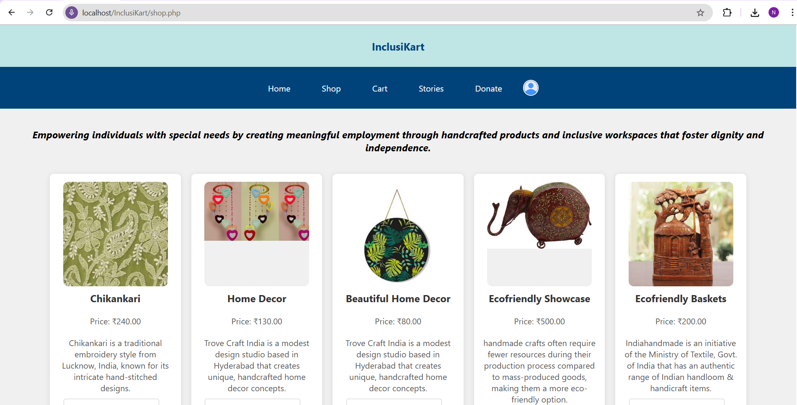
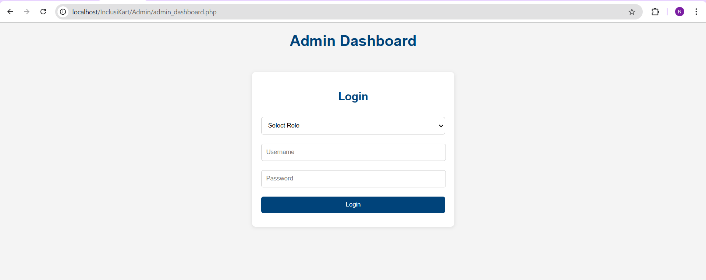
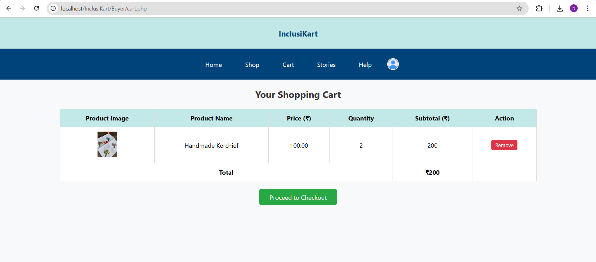

## 🧩 INCLUSIKART

 A web-based platform built to **empower specially-abled individuals** by providing a dedicated digital space where they can:

- 🛍️ Showcase and sell their **handmade or self-made products**
- ✨ Share their **personal stories and talents**

The platform promotes **inclusion and economic empowerment** by giving specially-abled entrepreneurs an opportunity to reach a **wider audience of supportive buyers**.

## ♿ ACCESSIBILITY FOCUSED DESIGN

InclusiKart places a strong emphasis on **accessibility**, ensuring that everyone can use the platform with ease. Key features include:

- 🔊 **Basic Voice navigation** for users with visual or motor impairments  
- 🎨 Clean, user-friendly design for better usability


## 🖼️ Project Screenshots
### 🏠 Home Page


### 🔒 Seller Profile


### 🛍️ Products Details


### 🧾 Shop Interface


### 🛠️ Admin Dashboard


### 🛒 Cart Page



## ✨ FEATURES

### 👤 User Management
- **Seller Registration**: Specially-abled users can sign up with disability certificate verification.
- **Secure Authentication**: Role-based login system for Sellers, Buyers, and Admins.

### 🛍️ Marketplace Functionality
- **Product Upload**: Sellers can upload their handmade or self-made products.
- **Admin Approval**: All listings are reviewed by admins before appearing on the site.
- **Buyer Interface**: Clean and intuitive design for browsing and purchasing products.

### 📖 Story Sharing
- **Inspiring Journeys**: Sellers can share their personal stories to highlight their talents and challenges.

### 🛠️ Admin Dashboard
- **Moderation Tools**: Admins can manage users, products, and stories through a dedicated dashboard.

### 🔊 Voice Navigation
- **Hands-Free Navigation**: Users can explore and interact with the platform using voice commands, improving accessibility for those with physical or visual limitations.

## 🛠️ TECH STACK

- **Frontend:** HTML, CSS, JavaScript  
- **Backend:** PHP  
- **Database:** MySQL  
- **Authentication:** Session-based (using PHP sessions)  
- **Voice Navigation:** Implemented using [Annyang.js](https://www.talater.com/annyang/) – a lightweight JavaScript library for adding voice commands  
- **Development Tools:** Visual Studio Code, XAMPP  
- **Status:** Actively maintained and version-controlled via GitHub


## SETUP INSTRUCTIONS

Follow these steps to set up and run the Inclusikart platform on your local machine:

### 1. **Install Required Software**

Make sure the following software is installed:

* [XAMPP](https://www.apachefriends.org/index.html) – for running Apache and MySQL
* [Visual Studio Code](https://code.visualstudio.com/) or any code editor of your choice

---

### 2. **Start Apache and MySQL**

* Open XAMPP Control Panel
* Start **Apache** and **MySQL**

---

### 3. **Import the Database**

1. Open your browser and go to `http://localhost/phpmyadmin`
2. Click on **Import**
3. Choose the `SQL-Database/inclusikart.sql` file from your project directory
4. Click **Go** to import the database

---

### 4. **Place Project Files in `htdocs`**

1. Copy complete project folder ( `InclusKart/`)
2. Paste it into `C:\xampp\htdocs\` or `D:\xampp\htdocs\`(where ever you have installed XAMPP)

---

### 5. **Configure Database Connection**

1. Open the project folder in VS Code
2. Find the PHP file that contains the database configuration (`db.php`)
3. Update the database connection variables if needed:

   ```php
   $host = 'localhost';
   $user = 'root';
   $password = '';
   $database = 'inclusikart';
   ```

---

### 6. **Access the Project in Browser**

Open your browser and visit:

```
http://localhost/InclusiKart/index.php
```

Replace `InclusiKart` with your actual project folder name if different.

---
### 7. **Test the Features**

- Register a new seller
- Submit verification details
- Login as admin to approve profiles
- Upload and approve products
- Try the donation/help feature and story sharing

---

### **Default Verifier Credentials**

You can log in to the [Admin Dashboard](http://localhost/InclusiKart/Admin/admin_dashboard.php) using these default credentials:

| Role             | Username       | Password     |
| ---------------- | -------------- | ------------ |
| Profile Verifier | `profile1`     | `pass123` |
| Product Verifier | `admin`        | `password123` |
| Story Verifier   | `story1`       | `pass123`   |
